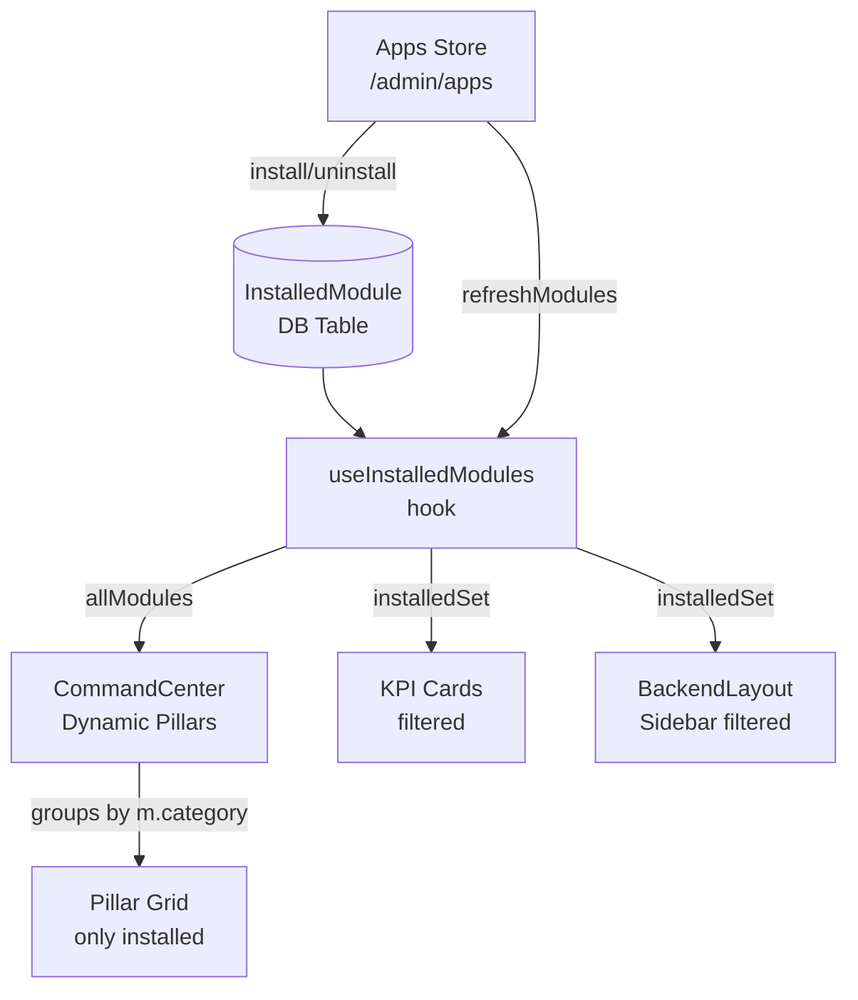

# Main Dashboard — ERP Architecture Alignment Plan

## 🔍 Audit Summary

The **Command Center** (`/admin`) has a fundamental architectural violation: its entire module tile grid is **hardcoded** (689 lines of static JSX). While it does call `useInstalledModules()`, it only uses the result to **dim** tiles — it never hides them. The correct Odoo/ERP behavior is:

> **The home screen shows ONLY installed apps. Uninstalled apps live exclusively in the App Store.**

### Bugs Found

| # | Bug | File | Impact |
|---|---|---|---|
| 1 | **Hardcoded tile catalog** — ~50 tiles always shown, only dimmed | `CommandCenter.jsx` | Every module always visible, regardless of install status |
| 2 | `allModules` from `useInstalledModules()` is **ignored** — the DB data is already there, just unused | `CommandCenter.jsx` | Duplicates real data source, can drift out of sync |
| 3 | **Restaurant shares `techName: 'pos'`** with Point of Sale | `CommandCenter.jsx` | Both dim/undim together — broken toggle logic |
| 4 | **Invoicing shares `techName: 'accounting'`** with Accounting | `CommandCenter.jsx` | Same as above |
| 5 | **Intelligence section in sidebar has `items: []`** — completely empty | `BackendLayout.jsx` | "Intelligence" heading with no children renders in sidebar |
| 6 | **KPI cards always show** for all 12 metrics regardless of installed modules | `CommandCenter.jsx` | e.g., "MRR" card shows even if Subscriptions not installed |

### Architecture: What Exists vs. What Should Be Used

```
CURRENT (WRONG)                         CORRECT (Odoo standard)
─────────────────────────────────────   ────────────────────────────────────────
CommandCenter hardcodes 50 tiles        CommandCenter reads allModules from DB
checks installedSet → dims tile         checks is_installed → shows OR hides
tile catalog = JSX in CommandCenter     tile catalog = InstalledModule records
                                        grouped by module.category field
```

The good news: **`useInstalledModules()`** already fetches `GET system/modules/` and exposes:
- `allModules` — full list with `{ technical_name, name, category, url, icon, is_installed }`
- `installedSet` — `Set<technical_name>` for O(1) lookup

The backend `InstalledModule` model already has: `name`, `category`, `url`, `icon`, `is_installed`, `technical_name`. Everything is in place — it's just not being used.

---

## Proposed Changes

### Component 1 — CommandCenter.jsx: Dynamic Tile Grid

**Replace** the static `enterprisePillars` array with a computed one built from `allModules`:

```js
// Current (WRONG) — static 50-tile hardcoded array
const enterprisePillars = [
    { name: 'Sales', tiles: [
        { title: 'Sales', techName: 'sale', ... },   // always shown
        { title: 'Restaurant', techName: 'pos', ... }, // BUG: same techName as POS
        ...
    ]}
];

// Correct (DYNAMIC) — built from DB
const installedModules = allModules.filter(m => m.is_installed);
const pillarsByCategory = groupBy(installedModules, m => m.category);
// Renders only installed ones, grouped by their DB category
```

**Also fix KPI cards**: filter them to only show cards whose associated module is installed.

### Component 2 — BackendLayout.jsx: Fix Intelligence Sidebar

The Intelligence sidebar section has `items: []`. Add the `ai_agent` entry to it (matching what CommandCenter already tries to link to):

```js
// Current
{ title: 'Intelligence', items: [] }

// Fixed
{ title: 'Intelligence', items: [
    { label: 'Virtual Employees', icon: Bot, path: '/admin/ai_agent', techName: 'ai_agent' }
]}
```

---

## AI Builder Prompts

> [!IMPORTANT]
> Give these prompts **one at a time** in order. Each prompt is a complete, self-contained task.

---

### Prompt 1 — Fix the Sidebar Intelligence Section

```
You are working on the file:
  frontend/src/core/layouts/BackendLayout.jsx

TASK: Fix the Intelligence sidebar section which currently has an empty items array.

Find the sidebar section object that looks like:
  { title: 'Intelligence', items: [] }

Replace the empty items array with:
  items: [
    { label: 'Virtual Employees', icon: Bot, path: '/admin/ai_agent', techName: 'ai_agent' },
  ]

Make sure the `Bot` icon is imported from 'lucide-react' at the top of the file.
Do not change anything else in the file.
```

---

### Prompt 2 — Rewrite CommandCenter Pillar Section to Use Live DB Data

```
You are working on the file:
  frontend/src/apps/board/pages/CommandCenter.jsx

CONTEXT:
- The component already calls: const { installedSet, allModules, loading: modulesLoading } = useInstalledModules();
- `allModules` is an array of objects from GET system/modules/ with shape:
  { id, technical_name, name, category, url, icon, is_installed }
- `installedSet` is a Set<string> of technical_names for installed modules

CURRENT PROBLEM:
The file has a large hardcoded array called `enterprisePillars` (~120 lines) that contains every possible module.
This is architecturally wrong. The dashboard should ONLY show modules that are installed.

TASK: Replace the hardcoded `enterprisePillars` array and its rendering logic with a dynamic version.

Replace the `enterprisePillars` const declaration AND its JSX rendering block with this logic:

1. Compute the dynamic pillars above the return statement:
```js
// Build dynamic pillars from installed modules only
const ICON_MAP = {
  // Map lucide icon name strings (from DB) to actual icon components
  DollarSign, Users, Monitor, LifeBuoy, PieChart, Box, Wrench, Truck, Package,
  Megaphone, Globe, Calendar, FolderKanban, Clock, Shield, Settings, Layers, Bot,
  ShoppingBag, Mail, Smartphone, Share2, FileQuestion, MessageSquare, BookOpen,
  PhoneCall, FolderOpen, CheckSquare, FileText, CreditCard, MapPin, Utensils,
  Award, UserPlus, Building2, Activity, BarChart3, Server, Key, Landmark, Leaf,
  Book, MessageCircle, Tag, Cpu
};

// KPI overlay: map technical_name → metric value + label
const MODULE_KPIS = {
  sale:        { kpi: metrics.sales?.orders,            kpiLabel: 'orders' },
  crm:         { kpi: metrics.crm?.active_clients,      kpiLabel: 'clients' },
  pos:         { kpi: metrics.pos?.sessions,             kpiLabel: 'sessions' },
  subscriptions: { kpi: metrics.billing?.active_subs,   kpiLabel: 'active subs' },
  accounting:  { kpi: metrics.erp?.overdue_invoices,    kpiLabel: 'overdue invoices' },
  hr_expense:  { kpi: metrics.erp?.pending_expenses,    kpiLabel: 'to approve' },
  sign:        { kpi: metrics.contracts?.active_contracts, kpiLabel: 'active contracts' },
  projects:    { kpi: metrics.projects?.active_projects, kpiLabel: 'active projects' },
  timesheets:  { kpi: metrics.projects?.missing_timesheets, kpiLabel: 'missing' },
  helpdesk:    { kpi: metrics.support?.open_tickets,    kpiLabel: 'open tickets' },
  stock:       { kpi: metrics.stock?.low_stock_items,   kpiLabel: 'low stock' },
  mrp:         { kpi: metrics.mrp?.open_orders,         kpiLabel: 'open orders' },
  purchase:    { kpi: metrics.purchase?.pending_orders,  kpiLabel: 'pending POs' },
  hr:          { kpi: metrics.hrm?.headcount,            kpiLabel: 'employees' },
  hr_holidays: { kpi: metrics.hrm?.pending_HrHolidays,  kpiLabel: 'to approve' },
  hr_recruitment: { kpi: metrics.hrm?.open_positions,   kpiLabel: 'open positions' },
  fleet:       { kpi: metrics.fleet?.vehicles,           kpiLabel: 'vehicles' },
  marketing:   { kpi: metrics.marketing?.active_campaigns, kpiLabel: 'campaigns' },
  website:     { kpi: metrics.website?.pages,            kpiLabel: 'pages' },
  blog:        { kpi: metrics.blog?.posts,               kpiLabel: 'posts' },
  documents:   { kpi: metrics.documents?.total,          kpiLabel: 'documents' },
  approvals:   { kpi: metrics.approvals?.pending,        kpiLabel: 'pending' },
  discuss:     { kpi: metrics.discuss?.unread,           kpiLabel: 'unread' },
  calendar:    { kpi: metrics.calendar?.events,          kpiLabel: 'today' },
  soc:         { kpi: metrics.security?.open_alerts,     kpiLabel: 'alerts' },
};

// STATUS mapping
const getStatus = (techName, kpi) => {
  if (techName === 'accounting' && metrics.erp?.overdue_invoices > 0) return 'warning';
  if (techName === 'stock' && metrics.stock?.low_stock_items > 0) return 'warning';
  if (techName === 'approvals' && metrics.approvals?.pending > 0) return 'warning';
  if (techName === 'soc' && metrics.security?.open_alerts > 0) return 'warning';
  return kpi > 0 ? 'active' : 'idle';
};

// Color cycling per category
const CATEGORY_COLORS = {
  'Sales': 'blue', 'Services': 'amber', 'Finance': 'emerald',
  'Inventory & MRP': 'orange', 'Human Resources': 'pink',
  'Marketing': 'rose', 'Intelligence': 'indigo', 'Website': 'sky',
  'Productivity': 'violet', 'Administration': 'slate',
};

// Group installed modules by category
const installedModules = allModules.filter(m => m.is_installed);
const grouped = installedModules.reduce((acc, m) => {
  const cat = m.category || 'Other';
  if (!acc[cat]) acc[cat] = [];
  acc[cat].push(m);
  return acc;
}, {});

// Convert to pillars array (preserving Odoo category order)
const CATEGORY_ORDER = [
  'Sales', 'Services', 'Finance', 'Inventory & MRP',
  'Human Resources', 'Marketing', 'Intelligence',
  'Website', 'Productivity', 'Administration'
];
const dynamicPillars = CATEGORY_ORDER
  .filter(cat => grouped[cat]?.length > 0)
  .map(cat => ({
    name: cat,
    tiles: grouped[cat].map(m => {
      const kpiData = MODULE_KPIS[m.technical_name] || {};
      return {
        title: m.name,
        techName: m.technical_name,
        path: m.url || `/admin/${m.technical_name}`,
        icon: ICON_MAP[m.icon] || Layers,
        color: CATEGORY_COLORS[cat] || 'blue',
        kpi: kpiData.kpi,
        kpiLabel: kpiData.kpiLabel || '',
        status: getStatus(m.technical_name, kpiData.kpi),
      };
    }),
  }));
```

2. In the JSX, replace everywhere you see `enterprisePillars.map(...)` with `dynamicPillars.map(...)`.

3. In each `ModuleTile` rendered from the map, remove the `isInstalled` prop calculation (since every tile in `dynamicPillars` is already installed). Always pass `isInstalled={true}`.

4. If `installedModules.length === 0` and `!modulesLoading`, render an empty state:
```jsx
<div className="text-center py-20 col-span-full">
  <Layers size={40} className="mx-auto mb-3 text-slate-700" />
  <p className="font-bold text-slate-300">No modules installed yet.</p>
  <Link to="/admin/apps" className="text-sky-400 text-sm hover:underline mt-2 inline-block">
    Browse the App Store →
  </Link>
</div>
```

5. Keep everything else in the file EXACTLY as-is: KPI strip, charts, Quick Actions, activity feed, system health.

6. Remove the `enterprisePillars` const declaration completely.
```

---

### Prompt 3 — Fix KPI Cards to Respect Installed Modules

```
You are working on the file:
  frontend/src/apps/board/pages/CommandCenter.jsx

CONTEXT:
- The file now uses `allModules` from `useInstalledModules()` for the tile grid
- There is also a `kpiCards` array with 12 hardcoded KPI cards that always render

TASK: Filter the `kpiCards` array so that each card only renders if its associated module is installed.

1. Add a `techName` property to each kpiCard object:
   - 'Monthly Revenue' → techName: 'ecommerce'
   - 'MRR' → techName: 'subscriptions'
   - 'Net Profit (MTD)' → techName: 'accounting'
   - 'Cash on Hand' → techName: 'accounting'
   - 'Outstanding A/R' → techName: 'accounting'
   - 'Active Clients' → techName: 'crm'
   - 'Security Alerts' → techName: 'soc'
   - 'Open Support Tickets' → techName: 'helpdesk'
   - 'Pending Orders' → techName: 'ecommerce'
   - 'Active SLA Contracts' → techName: 'sign'
   - 'Active Employees' → techName: 'hr'
   - 'Active Projects' → techName: 'projects'

2. When rendering the KPI grid, filter the array:
```js
const visibleKpis = kpiCards.filter(card => 
  installedSet.has(card.techName)
);
```

3. Render `visibleKpis` instead of `kpiCards` in the JSX.

4. If `visibleKpis.length === 0`, do not render the KPI section at all (hide the whole grid container).

Do not change anything else.
```

---

### Prompt 4 — Fix the `useInstalledModules` Hook to Expose Icon Mapping

```
You are working on the file:
  frontend/src/core/hooks/useInstalledModules.jsx

CONTEXT:
The hook currently fetches `GET system/modules/` and builds:
- `allModules` — raw array from DB
- `installedSet` — Set<technical_name> of installed modules

TASK: Add one more derived value to the context: `installedByCategory`.

After the line:
  setInstalledSet(installed);

Add:
  // Build a category map for easy pillar rendering
  const byCategory = modules
    .filter(m => m.is_installed)
    .reduce((acc, m) => {
      const cat = m.category || 'Other';
      if (!acc[cat]) acc[cat] = [];
      acc[cat].push(m);
      return acc;
    }, {});
  setInstalledByCategory(byCategory);

Add a new state:
  const [installedByCategory, setInstalledByCategory] = useState({});

Add `installedByCategory` to the context value object:
  value={{ installedSet, allModules, installedByCategory, loading, refreshModules: fetchModules }}

Add `installedByCategory` to the default context:
  const InstalledModulesContext = createContext({
    installedSet: new Set(),
    allModules: [],
    installedByCategory: {},
    loading: true,
    refreshModules: async () => {},
  });

Do not change anything else.
```

---

### Prompt 5 — Verification

After applying all 4 prompts above, run:
```bash
npm run build
```
And confirm:
- Build exits with code 0
- No TypeScript/ESLint errors about undefined variables
- The `enterprisePillars` const no longer appears anywhere in `CommandCenter.jsx`
- The `dynamicPillars` variable IS present in `CommandCenter.jsx`

---

## Expected Behavior After Fix

| Scenario | Before (buggy) | After (correct) |
|---|---|---|
| User has only CRM + Accounting installed | Shows all 50 tiles, 48 dimmed | Shows only 2 tiles (CRM + Accounting) |
| User installs WhatsApp | WhatsApp tile was always visible (just dimmed) | WhatsApp tile appears on dashboard after install |
| User uninstalls SMS | SMS tile stays, just dimmed | SMS tile completely disappears from dashboard |
| Intelligence section | Has 1 tile (always visible, dimmed if not installed) | Shows only if `ai_agent` is installed |
| KPI strip | All 12 cards always shown | Only cards for installed modules shown |
| Sidebar Intelligence | Empty (no children) | Shows "Virtual Employees" if ai_agent installed |

## Architecture Diagram (Target)


